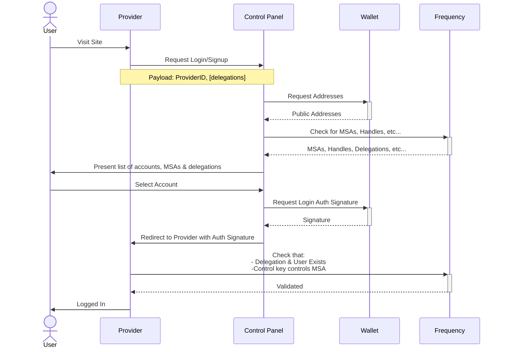

# Sequence Diagram of Login Flow

```mermaid
sequenceDiagram
    actor A as User
    participant P as Provider
    participant CP as Control Panel
    participant W as Wallet
    participant F as Frequency

    A->>P: Visit Site
    P->>CP: Request Login/Signup
    Note over P,CP: Payload: ProviderID, [delegations]
    CP->>+W: Request Addresses
    W-->>-CP: Public Addresses
    CP->>+F: Check for MSAs, Handles, etc...
    F-->>-CP: MSAs, Handles, Delegations, etc...
    CP->>A: Present list of accounts, MSAs & delegations
    A->>CP: Select Account
    CP->>+W: Request Login Auth Signature
    W-->>-CP: Signature
    CP->>P: Redirect to Provider with Auth Signature
    P->>+F: Check that:<br/>- Delegation & User Exists<br/>-Control key controls MSA
    F-->>-P: Validated
    P->>A: Logged In
```
