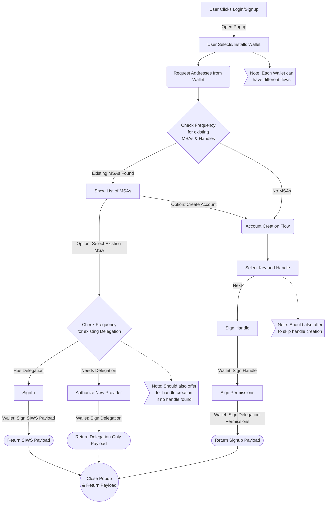
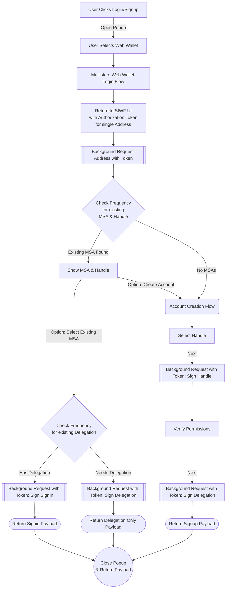
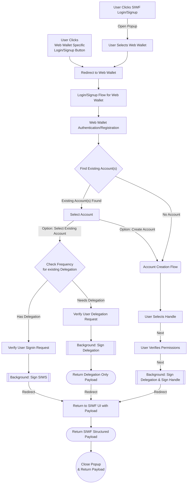

# UI Flow Overview

## Existing Flow with Notes

## Web Wallet Integration Option 1: Use SIWF UI

Open Question: How can we make sure the auth token isn't hijacked?

## Web Wallet Integration Option 2: Custom UI

