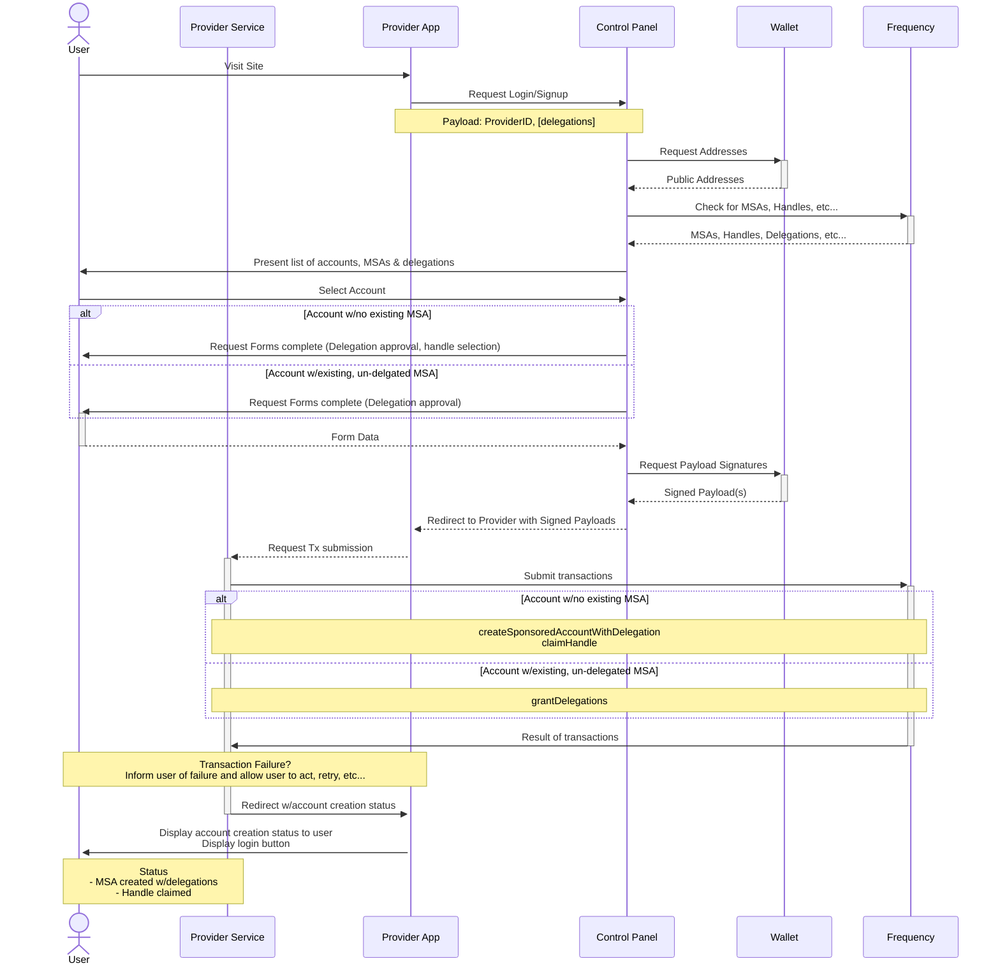

```mermaid
sequenceDiagram
    actor A as User
    participant PS as Provider Service
    participant P as Provider App
    participant CP as Control Panel
    participant W as Wallet
    participant F as Frequency

    A->>P: Visit Site
    P->>CP: Request Login/Signup
    Note over P,CP: Payload: ProviderID, [delegations]
    CP->>+W: Request Addresses
    W-->>-CP: Public Addresses
    CP->>+F: Check for MSAs, Handles, etc...
    F-->>-CP: MSAs, Handles, Delegations, etc...
    CP->>A: Present list of accounts, MSAs & delegations
    A->>CP: Select Account
    alt Account w/no existing MSA
    CP->>+A: Request Forms complete (Delegation approval, handle selection)
    else Account w/existing, un-delgated MSA
    CP->>+A: Request Forms complete (Delegation approval)
    end
    A-->>-CP: Form Data
    CP->>+W: Request Payload Signatures
    W-->>-CP: Signed Payload(s)
    CP-->>+P: Redirect to Provider with Signed Payloads
    P-->>+PS: Request Tx submission
    PS->>+F: Submit transactions
    alt Account w/no existing MSA
    Note over PS,F: createSponsoredAccountWithDelegation<br/>claimHandle
    else Account w/existing, un-delegated MSA
    Note over PS,F: grantDelegations
    end
    F->>-PS: Result of transactions
    Note over A,P: Transaction Failure?<br/>Inform user of failure and allow user to act, retry, etc...
    PS->>-P: Redirect w/account creation status
    P->>A: Display account creation status to user<br/>Display login button
    Note over A,PS: Status<br/>- MSA created w/delegations<br/>- Handle claimed
```
